# Preparing for re:Invent in Las Vegas

| Tip                                                                 | Description                                                                 |
|---------------------------------------------------------------------|-----------------------------------------------------------------------------|
| Wear comfortable, lightweight running shoes                         | For extensive walking (20,000 steps daily).                                  |
| Prepare for dry desert air with skincare essentials                 | Creams, lip balm, and eye drops.                                            |
| Bring throat soothers and familiar medications                      | For potential health issues.                                                 |
| Pack warm clothing                                                  | For the outdoor re:Play party.                                               |
| Remember US power adapters                                          | Consider bringing an extension cord.                                         |
| Carry USB-A cables                                                  | For charging in hotels and on planes.                                        |
| Bring a power bank                                                  | For extended phone use during presentations.                                 |
| EXTRA luggage                                                       | For conference swag.                                                         |
| Utilize online hotel check-in                                       | To save time.                                                                |
| Consider visiting the Grand Canyon and Hoover Dam                   | Possibly via helicopter tour.                                                |
| Explore The Strip                                                   | For its iconic hotels, casinos, and light shows.                             |
| Check out The Sphere                                                | A new immersive entertainment venue.                                         |
| Attend vendor-sponsored events                                      | For networking and free refreshments.                                        |
| Use the conferenceparties.com website                               | To find accompanying events during re:Invent.                                |

## All Keynotes are in one venue: Venetian | Level 2 | Venetian Ballroom F

### All BootCamps are in one venue: Mandalay Bay | Level 2 South

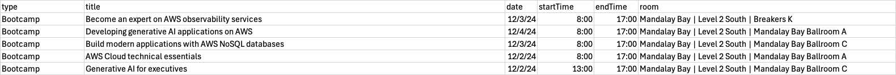

### Breakout sessions

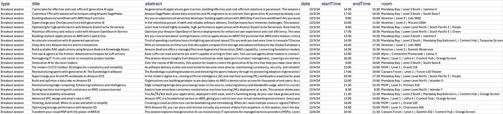

### Chalk Talk

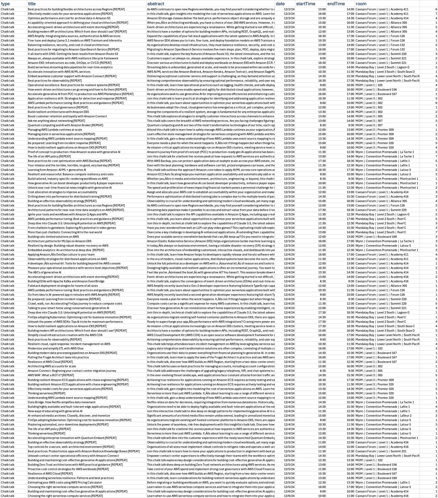

### Code Talk

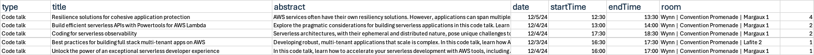

### Community Activity Venue: Venetian

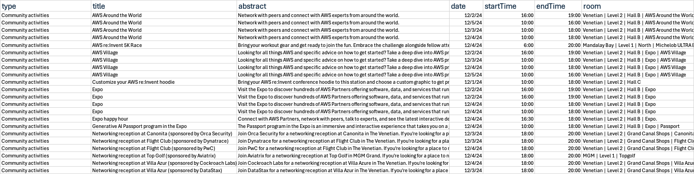

### Confernce Service lunch/food/rest

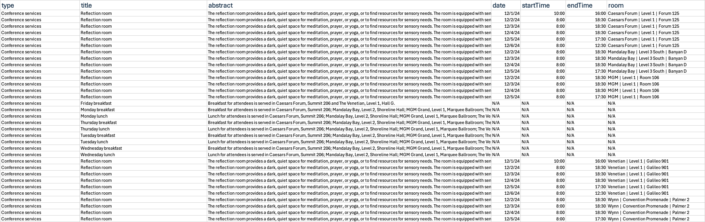

### Dev Chat Venue: Venetian Hall

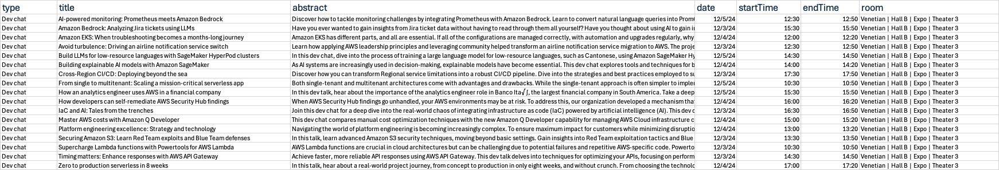

### Exam Prep Venue: Mandalay Bay

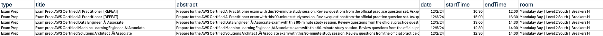

### Gamified Learning Venue: Mandalay

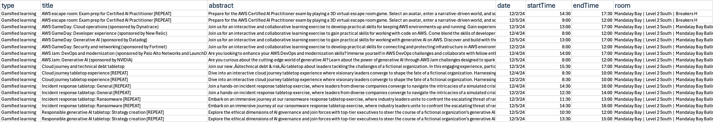

### Innovation Talk Venue: Venetian

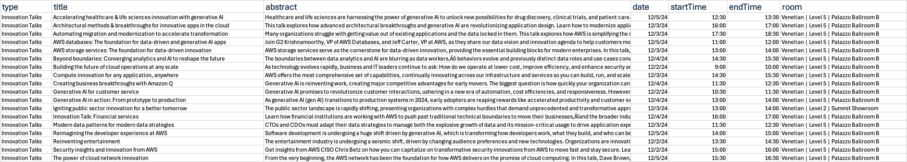

### Interactive Traning Venue: Mandalay

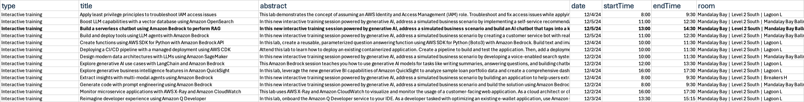

### Self-Paced Training

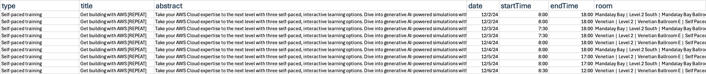

### Builder's Fair Venue: Venetian

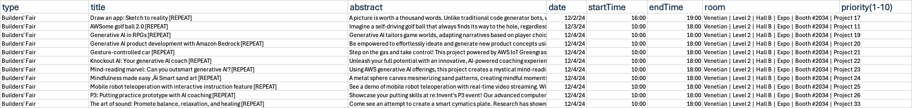

### Workshop

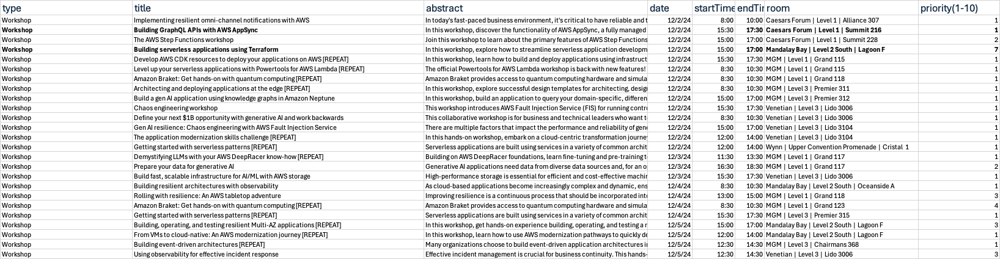

### Final List

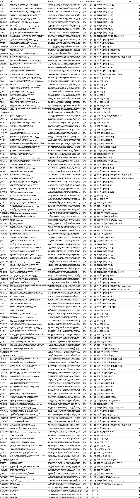
